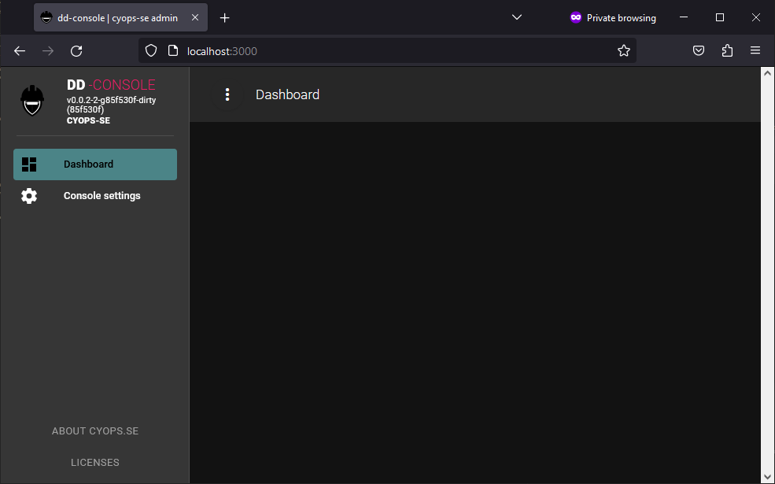
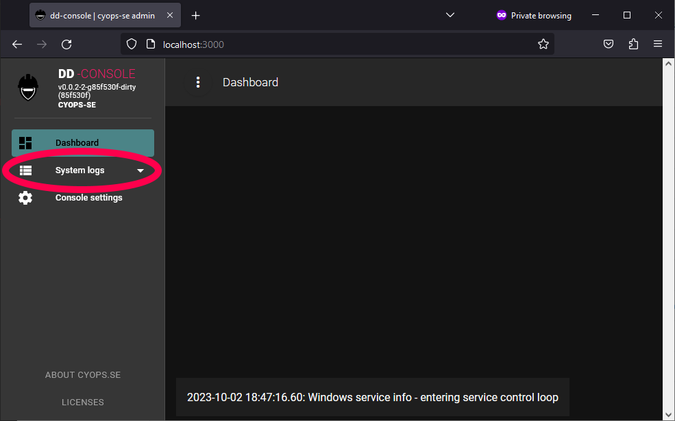
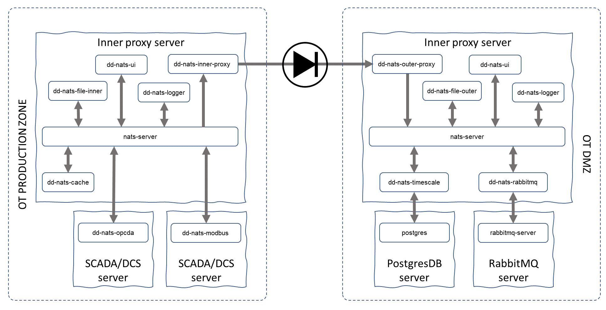

# dd-nats
*NOTE! This repo represents the successor of the previous dd-opcda and dd-inserter repos intended for export of ICS data and files through a data diode.*

# Table of contents
1. [Overview](#overview)
2. [Microservice architecture (usvc)](#microservice-architecture-usvc)
3. [Common user interface console (dd-ui)](#common-user-interface-console-dd-ui)
4. [**Inner** side of the data diode](#inner-side-of-the-data-diode)
4. [**Outer** side of the data diode](#outer-side-of-the-data-diode)
5. [Installation](#installation)
6. [Fourth Example](#fourth-examplehttpwwwfourthexamplecom)

## Overview
The dd-nats repo contains a set of micro-services (usvcs) that together provide a solution for export of ICS (Industrial Control System) data and files over a data-diode. It currently contain collectors for OPC DA and Modbus TCP, but following the usvc architecture, it is easy to add new collectors for other sources. On the other side of the diode, the data is received by a set of usvcs that store the data in a database and/or forward it to other systems.

As message brokers, the usvcs architecture on both sides of the diode use either [NATS](https://nats.io/) or [MQTT](https://mqtt.org/). These are both lightweight and high-performance messaging system. You are encouraged to read more about NATS and MQTT unless you are already comfortable with the concept of message brokers. Both publish/subscribe and request/reply patterns are used by the applications in this repository. The repo continue to carry the name ***dd-nats*** even though it now supports additional message brokers like MQTT by implementing the specified interfaces in ```ddmb```.


Each usvc typically have a passive and an active part, where the passive is responding to requests from consumers and the active part process information in the background and publish the results to the NATS server, for example the OPC DA signal collector. The passive part is used to configure which tags to collect from which OPC DA server at what interval, and the active part collects and publish the data.

## Microservice architecture (usvc)
All dd-* executables are designed as separate microservices (usvcs) with one service in each executable, using NATS as interface middleware. The common usvc framework implement a common interface for settings management and also emits a heartbeat to indicate the availability of the service ```system.heartbeat``` (message contain information about the usvc in the format ```{"hostname":"[hostname]","identity":"default","appname":"dd-*","version":"[git tag]","timestamp":"2023-04-30T18:17:19.4909825Z"}```). Usvc specific methods are registered with the framework which make them available for other usvcs to consume. A usvc can implement background workers that also emit messages that other services may subscribe to, for example the process data collected by ```dd-nats-opcda``` and ```dd-nats-modbus```.

Typically, a method is registered with a service name, identity and method name as subjects in the format: ```usvc.[shortname].[identity].[methodname]```. A method in the OPC DA collector that gets all configured groups would for example be regsitered as: ```usvc.opc.cs1.group.getall``` (where ```opc``` is the shortname of the service **note that it does not have to be the same as the service name**, ```cs1``` is the instance identity and ```group.getall``` is the method name). The instance identity is useful if you want to run several instances of the same service. If several instances run with the same identity, there will be a race condition between them when trying to manage servers, groups, tags and settings.

The usvc framework implements a few methods for common management of settings, which is handy as it enables the UI to handle settings for each usvc without custom code. These methods are (**note that the service name here is actual servicename without dashes '-', for example ```ddnatsopcda```)

- ```usvc.[servicename].[identity].settings.get```, which does not take any arguments and returns a list of all defined settings for the usvc.
- ```usvc.[servicename].[identity].settings.set```, which takes a message in the same format as is received by ```get``` as argument for new settings (persistent)
- ```usvc.[servicename].[identity].settings.delete```, which takes an argument in the format ```{"item": "[name of setting to delete]"}``` that deletes the specified setting.

## Common user interface console (dd-ui)
The dd-ui application is a web application based on Vuetify 2 as frontend and NATS (via REST and Websockets) as backend. It implements all user interface views for the usvcs in the repo and displays the relevant user interface depending the heartbeats emitted from the usvcs connected to the same NATS instance as the dd-ui process. If no usvcs are running, an empty console is displayed.

The left side constitute the meny that is populated depending of which services publishing heartbeats. The dashboard view is hardcoded with some basic information of certain services, like ```dd-nats-opcda``` and ```dd-nats-modbus``` when they are running.



After starting the ```dd-logger``` usvc, the view representing the dd-logger usvc show up in the meny to the left.



## Inner side of the data diode
The term 'inner' refers to applications and activities that operates on the ICS networks on the inside of the diode. In other data diode contexts, the term "upstream", "high end" or "sender" is used insted to describe the sending side. There are several usvcs on the inner side, some collect information to be forwarded to the outer side and others are support services used for management, visibility and diagnostics. This repo currently contain the following usvcs for the inner side of the data diode (in addition to **```dd-ui```** which should run on both sides):

- [dd-nats-inner-proxy](#dd-nats-inner-proxy)
- [dd-nats-opcda](#dd-nats-opcda)
- [dd-nats-modbus](#dd-nats-modbus)
- [dd-nats-file-inner](#dd-nats-file-inner)
- [dd-nats-logger](#dd-nats-logger)

### dd-nats-inner-proxy
Subscribes to NATS subjects specified in the inner proxy settings page which by default are: **```process.>, file.>, system.log.>, system.heartbeat```** and forwards subject and data as UDP unicast to specified IP address and port. It assumes dd-nats-outer-proxy listens to that port on that IP address. The '```>```' sign in the subject indicate a wildcard that accepts anything (including ```.```). As it forwards NATS messages to the outer side where they are re-published as they were on the inside, it is possible to use this mechanism to forward any data from the inside to the outside by simlply publishing it as a NATS message.

### dd-nats-opcda
Collects specified process values (tags) from local OPC DA servers and publish them to NATS subject: **```process.actual```**, message: **```{"t": "[time]", "n": "[tagname]", "v": [value], "q": [quality]}```**. It implement methods for browsing local OPC DA servers and manage groups and tags. A tag is assigned to a group, where the group specifies sampling time and the tag represents the OPC DA tag name to be collected. The user interface is used to manage tags to be collected either using the built-in browser, or by importing a CSV file with the tags. See [this section](./inner/dd-nats-opcda/README.md) for more information on the ```dd-nats-opcda``` user interface.

### dd-nats-modbus
This microservice (usvc) collects data from Modbus TCP slaves and is configured by importing a CSV with information of the slave and registers to collect. It is currently very limited and only support simple 16-bit floats using function codes 3 (holding registers) and 4 (input registers). Successfully collected data points are published the same way as ```dd-nats-opcda```. See [this section](./inner/dd-nats-modbus/README.md) for more information on the ```dd-nats-modbus``` user interface.

### dd-nats-cache
Taking advantage of the benefits of a messaging system, this usvc subscribes to the subject **```process.actual```** similar to ```dd-nats-inner-proxy``` and stores the collected values as compressed files in 5 minute segments and retains them for a configurable number of days, default 7. These files are listed in the user interface which allow an operator to select specific time slots and re-send them to the outer side for re-processing which is useful if messages for some reason cannot be received or processed on the outer side of the data diode. See [this section](./inner/dd-nats-cache/README.md) for more information on the ```dd-nats-cache``` user interface.

### dd-nats-file-inner
This usvc monitors a local directory **```./outgoing/new```** on the host it is running, relative to the service working directory. Files that are put in that directory are read by this service and published to NATS as fixed sized segments representing the file content. A subscriber of these messages can re-create the file, including any sub-directory to ```new```, see [dd-nats-file-outer](#dd-nats-file-outer). See [this section](./inner/dd-nats-file-inner/README.md) for more information on the ```dd-nats-file-inner``` user interface.

### dd-nats-logger
Subscribes to "system log" which are generated by using the framework methods ```ddsvc.ddsvc.Log|Info|Trace|Error```. Calling these methods will print the message to the console as well as publish it to NATS subject: **```system.log```** with a message in the format: ```{"time": "[time in UTC]", "category": "[category]", "title": "[title]", "description": "[description]"}```. See [this section](./inner/dd-nats-logger/README.md) for more information on the ```dd-nats-logger``` user interface.

## Outer side of the data diode
The term 'outer' refers to applications and activities operating on the outside of the data diode, typically in an IT DMZ or directly on the office network. In other data diode contexts, the term "downstream", "low end" or "receiver" is used insted to describe the receiving side. There are several usvcs on the outer side that process messages forwarded from the innter side and others are support services used for management, visibility and diagnostics. This repo currently contain the following usvcs for the outer side of the data diode (in addition to **```dd-ui```** which should run on both sides):

- [dd-nats-outer-proxy](#dd-nats-outer-proxy)
- [dd-nats-process-filter](#dd-nats-process-filter)
- [dd-nats-timescale](#dd-nats-timescale)
- [dd-nats-rabbitmq](#dd-nats-rabbitmq)
- [dd-nats-influxdb](#dd-nats-influxdb)
- [dd-nats-file-outer](#dd-nats-file-outer)
- [dd-nats-logger](#dd-nats-logger)
- [dd-nats-legacy-proxy](#dd-nats-legacy-proxy)

### dd-nats-outer-proxy
Listens for UDP unicast messages on specified port (typically the one connected to the data diode downstream interface) and publishes the received data on the subject provided in the message with a configurable prefix to distiguish messages coming from the inside of the data diode, default ```'inner.'```. See [this section](./inner/dd-nats-outer-proxy/README.md) for more information on the ```dd-nats-outer-proxy``` user interface.

### dd-nats-process-filter
This is a good example of the benefits with a message system based design as it allow injecting additional processing into an existing messaging pipeline. This usvc subscribes to the raw process data message flow from the inner side similar to the default subscriptions of other usvcs on the outside like ```dd-nats-timescale```. Different filters can then be applied to the received process data, which are then published on a new subject, for example to implement an integrating deadband before inserting the values to a database. See [this section](./inner/dd-nats-process-filter/README.md) for more information on the ```dd-nats-process-filter``` user interface.

### dd-nats-timescale
Normally subscribes to ```inner.process.actual``` to receive all raw data points from the inside which then are inserted into a Timescale timeseries database (extension to postgresdb). The subscription topic is configurable to support filtered data points published by ```dd-nats-process-filter``` rather than the raw points from the inside. See [this section](./inner/dd-nats-timescale/README.md) for more information on the ```dd-nats-timescale``` user interface.

### dd-nats-rabbitmq
Subscribes to ```inner.process.actual``` and simply forwards all messages to the specified RabbitMQ host and channel. See [this section](./inner/dd-nats-rabbitmq/README.md) for more information on the ```dd-nats-rabbitmq``` user interface.

### dd-nats-influxdb
Normally subscribes to ```inner.process.actual``` to receive all raw data points from the inside which then are inserted into a InfluxDB v1 timeseries database. The subscription topic is configurable to support filtered data points published by ```dd-nats-process-filter``` rather than the raw points from the inside. See [this section](./inner/dd-nats-influxdb/README.md) for more information on the ```dd-nats-influxdb``` user interface.

### dd-nats-file-outer
This usvc subscribes for file messages sent by [dd-nats-file-inner](#dd-nats-file-inner) and recreates the files locally in the directory **```./incoming/done```** on the host it is running, relative to the service working directory. See [this section](./outer/dd-nats-file-outer/README.md) for more information on the ```dd-nats-file-outer``` user interface.

### dd-nats-logger
Subscribes to "system log" which are generated by using the framework methods ```ddsvc.ddsvc.Log|Info|Trace|Error```. Calling these methods will print the message to the console as well as publish it to NATS subject: **```system.log```** with a message in the format: ```{"time": "[time in UTC]", "category": "[category]", "title": "[title]", "description": "[description]"}```. See [this section](./inner/dd-nats-logger/README.md) for more information on the ```dd-nats-logger``` user interface.

### dd-nats-legacy-proxy
Implements a proxy compatible with the older ```dd-opcda``` version to enable use of NATS on the outside without having to upgrade the inside.

## Installation
Basic knowledge of the operating systems assigned for the solution should be sufficient, but experience in troubleshooting networks including using tools like ```tcpdump```, ```tshark``` or ```wireshark``` can be valuable. Otherwise, this is the time to start learning them :)

As most microservices (usvc) are implemented in separate executables, there is basically one executable per usvc, which can seem a bit hard to handle. The upside is however that it is possible to run them in different hosts for minimum impact of the sensitive system in production, and you can choose which services you want or not by simply not installing the ones you don't want. Typically, only the ```dd-nats-opcda``` usvc is installed in a OT system host because it require local access to the OPC DA server. All other usvcs can run in a separate host, like the inner proxy host.

In the following (not very realistic) example on the inner side there are two SCADA hosts, one Windows base in which a OPC DA server is running and one Linux based host in which the modbus master is running (connecting to Modbus TCP slaves in the process network). There is also a Linux based host where the inner proxy and support processes are running. On the outer side we have a Linux host running all the services, including the one reading data coming from the data diode. **NOTE:** To avoid dropping packets, it is important that the two proxy hosts have separate network interfaces connected to the data diode. The server running the outer proxy must also be able to process all received messages, which typically requires it to have better performance than the inner proxy server. If the outer proxy service are unable to publish the received messages in the same rate as they are received from the data diode, there will be lost messages. Loosing a few process data messages may not be a problem, but loosing a file segment message means corrupting the file making it unusable on the outside.




### Static ARP for outer proxy data diode network interface
Assuming there are suitable hosts for the deployment, with a separate host running the inner proxy service that have a dedicated network interface for the data diode, there is really only one important aspect to make it work. The **inner proxy** host is using UDP which require MAC to IP lookup which normally is handled by ARP, but which is not available in a one-direction environment as it is two-directional by nature. Instead, the IP and MAC of the network interface on the outer proxy host dedicated for the data diode, must be documented for static configuration in the inner proxy host (lookup how to set a persistent static ARP for your host).

For Windows hosts, this can often be accomplished using the ```netsh``` command:

```
netsh interface ipv4 set neighbors Interface="DIODEnet" address=10.0.0.11 neighbor=3c-18-a0-0d-5d-a3 store=persistent
```

In some Linux hosts it can be accomplished by adding an entry to the ```/etc/ethers``` file:

```
3C:19:A0:0D:5D:A3  10.0.0.11
```

### Installing a usvc as Windows service
Start a command prompt (cmd) or powershell terminal as Administrator (or as a user with privileges to install new services) and navigate to the directory where the usvc executable is located, in this example we go to dd-nats-opcda.

Run the following command:

```
.\dd-nats-opcda -cmd install
```

This will create a new Windows service entry. Now open the services management console (services.msc) and find 'dd-nats-opcda from cyops-se'. Change start method and account information if needed. Start method must be changed to **Automatic** for the service to start automatically after a system reboot, and the account under which the service runs must be permitted to access the OPC DA server (only relevant for the dd-nats-opcda usvc).

To remove the service, just run the following command as Administrator:

```
.\dd-nats-opcda -cmd remove
```
