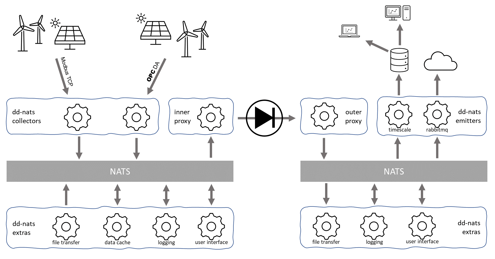

# dd-nats
***NOTE! This repo represents the successor of the previous dd-opcda and dd-inserter repos intended for export of ICS data and files through a data diode.***

## Overview
The dd-nats repo contains a set of micro-services (usvcs) that together provide a solution for export of ICS (Industrial Control System) data and files over a data-diode. It currently contain collectors for OPC DA and Modbus TCP, but following the usvc architecture, it is easy to add new collectors for other sources. On the other side of the diode, the data is received by a set of usvcs that store the data in a database and/or forward it to other systems.

As message broker, the usvcs architecture on both sides of the diode use NATS, a lightweight, high-performance cloud native messaging system. 

Each usvc typically have a passive and an active part, where the passive is responding to requests from consumers and the active part process information in the background and publish the results to the NATS server, for example the OPC DA signal collector. The passive part is used to configure which tags to collect from which OPC DA server at what interval, and the active part collects and publish the data.

## inner
The term 'inner' refers to applications and activities that operates on the ICS networks on the inside of the diode. In other data diode contexts, the term "upstream" or "high end" is used insted to describe the sending side. There are several usvcs on the inner side, some collect information to be forwarded to the outer side and others are support services used for management, visibility and diagnostics.

### dd-nats-inner-proxy
Subscribes to NATS subject dd.forward.> and forwards subject and data as UDP unicast to specified IP address and port. It assumes dd-nats-outer-proxy listens to that port on that IP address.

dd.forward.message.> -> dd.received.message.>
{"version": "", "id": "", "size": 0, "payload": ""}

dd.forward.file
{"type": "start", "version": "", "host": "", path: "", filename: "", "size": 0, hash: "", "id": ""}
{"type": "block", "version: "", "id": "", "payload": ""}
{"type": "done", "version": "", "id": ""}

dd.forward.stream.> -> dd.received.stream.> 
{"type": "start", "version": "", "host": "", name: "", "id": ""}
{"type": "block", "version: "", "id": "", "payload": ""}
{"type": "done", "version": "", "id": ""}

### dd-nats-opcda
### dd-nats-modbus
### dd-nats-cache
### dd-nats-file-inner
### dd-nats-logger

## outer
The term 'outer' refers to applications and activities operating on the outside of the data diode, typically in an IT DMZ or directly on the office network. In other data diode contexts, the term "downstream" or "low end" is used insted to describe the receiving side.

### dd-nats-outer-proxy
Listens for UDP unicast messages on specified port and publish the received data on the subject provided in the message.

### dd-nats-postgresdb
### dd-nats-rabbitmq
### dd-nats-file-outer
